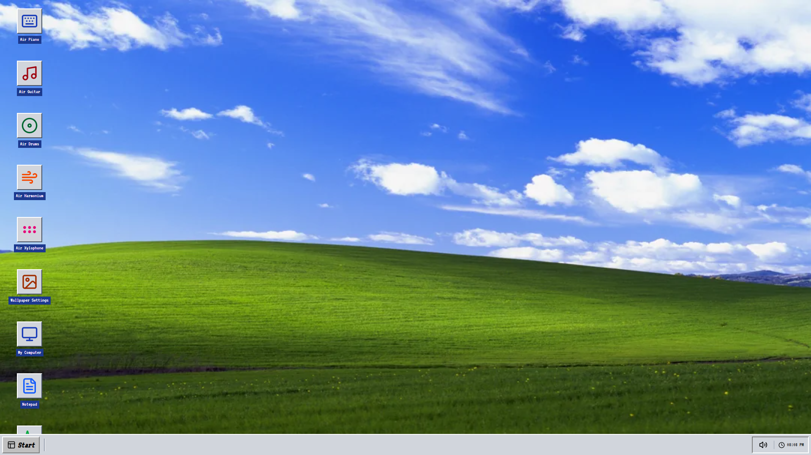
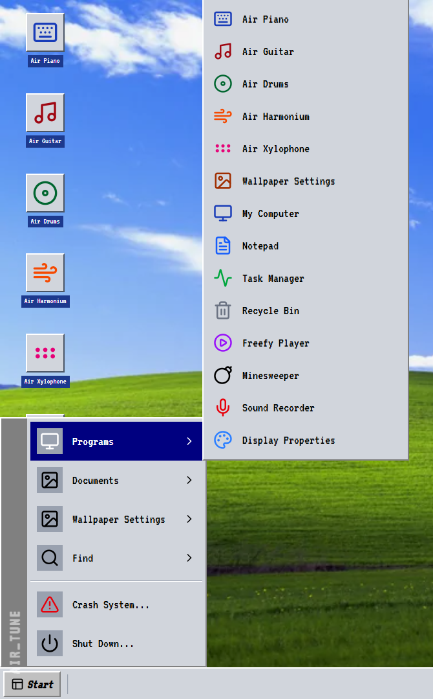

<div align="center">


</div>

## 💾 ABOUT AIR TUNE

**AIR TUNE** is a browser-based, gesture-controlled music workstation built with a nostalgic 90s OS aesthetic. It leverages advanced computer vision to map hand movements captured via webcam to high-fidelity audio synthesis in real-time. 

No MIDI controllers, no physical keys—just your hands and the air.

---

## 📸 SCREENSHOTS & DEMO

<div align="center">
  <p align="center">
    
    ##
  </p>
  <p><i>(Replace these with actual screenshots of your app! Tip: Use a GIF of you playing the Air Piano for maximum impact.)</i></p>
</div>

---

## 🚀 CORE FEATURES

*   **Real-time Hand Tracking**: Powered by MediaPipe Hands — 21 landmarks per hand tracked at up to 60fps for ultra-responsive control.
*   **Multi-Instrument Suite**:
    *   🎹 **Air Piano**: Dual-hand polyphonic synthesis with octave and note mapping.
    *   🥁 **Air Drums**: Virtual pad striking (Sticks mode) and finger-tap triggering (Fingers mode).
    *   🎸 **Air Guitar**: Strumming mode with chord selection and a full 15-fret virtual fretboard.
    *   🎼 **Air Harmonium**: Traditional bellows-style instrument with gesture-based note triggering.
    *   🔨 **Air Xylophone**: Precision striking of virtual bars with visual feedback.
*   **Low Latency Audio**: Built on **Tone.js** and the Web Audio API for sub-16ms response times.
*   **Retro OS Aesthetic**: A fully immersive Windows 9x-style interface complete with window management, pixel fonts, and CRT-style UI elements.
*   **Zero Install**: Runs entirely in the browser using WebGL and Web Audio—no drivers or external software required.

---

## 🖐️ GESTURE MAPPING GUIDE

| Instrument | Gesture | Action |
|:---:|:---|:---|
| **Piano** | **Left Hand (1-7 fingers)** | Select Octave (1-7) |
| **Piano** | **Right Hand (1-7 fingers)** | Play Note (A-G) |
| **Drums** | **Index Finger (Sticks Mode)** | Strike Virtual Pads on Screen |
| **Drums** | **Finger Taps (Fingers Mode)** | Trigger Kick, Snare, Hi-hat, Toms |
| **Guitar** | **Left Hand Gestures** | Select Chord (C, D, E, F, G, Am) |
| **Guitar** | **Right Hand Movement** | Strum Up/Down in the Air |
| **Guitar** | **Both Hands (Fretboard)** | Press Strings & Frets on Virtual Grid |
| **Harmonium**| **Left Hand (1-3 fingers)** | Select Octave (Low, Mid, High) |
| **Harmonium**| **Right Hand (1-7 fingers)** | Play Swaras (Sa, Re, Ga, Ma, Pa, Dha, Ni) |

---

## 🛠️ TECH STACK

*   **Framework**: [React 18](https://reactjs.org/)
*   **Tracking**: [MediaPipe Hands](https://google.github.io/mediapipe/solutions/hands)
*   **Audio Engine**: [Tone.js](https://tonejs.github.io/) (Web Audio API)
*   **Styling**: [Tailwind CSS](https://tailwindcss.com/)
*   **Animations**: [Motion](https://motion.dev/)
*   **Icons**: [Lucide React](https://lucide.dev/)
*   **Build Tool**: [Vite](https://vitejs.dev/)

---

## ⚡ QUICK START

1.  **Clone the repository**:
    ```bash
    git clone https://github.com/your-username/air-tune.git
    cd air-tune
    ```

2.  **Install dependencies**:
    ```bash
    npm install
    ```

3.  **Run the development server**:
    ```bash
    npm run dev
    ```

4.  **Open your browser**:
    Navigate to `http://localhost:3000` and allow camera access.

---

## 📈 PERFORMANCE METRICS

*   **Tracking Latency**: ~10-15ms
*   **Audio Response**: <16ms
*   **Landmark Points**: 21 per hand
*   **Browser Support**: Chrome, Edge, Firefox (Latest)
*   **Mobile Support**: Experimental (Landscape mode recommended)

---

## 🗺️ ROADMAP

- [x] Core Gesture Engine (MediaPipe Integration)
- [x] Multi-Instrument Support (Piano, Drums, Guitar, Harmonium, Xylophone)
- [x] Retro OS UI Framework
- [x] Low-latency Audio Pipeline
- [ ] MIDI Export Support
- [ ] Multi-user Jam Sessions (WebSockets)
- [ ] Session Recording & Export
- [ ] Custom Preset Saving

---

## 📄 LICENSE

Distributed under the MIT License. See `LICENSE` for more information.

<div align="center">
  
  <p><i>"The future of music is in the air."</i></p>
</div>
