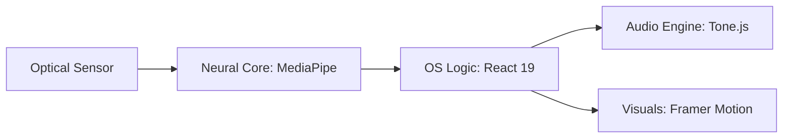

\<div align="center"\>

# 💿 AIR\_OS // NEURAL\_WORKSTATION\_v1.0

### [ 🟢 SYSTEM\_STATUS: STABLE ]

\

\<p align="center"\>
\
\
\
\</p\>

**Air OS** is a browser-native, gesture-reactive performance environment. It digitizes human motion into high-fidelity soundscapes, bypassing MIDI hardware via real-time hand landmark projection and hardware-accelerated synthesis.

-----

## 📂 MOUNTED\_DRIVES [ THE SUITE ]

\<table border="0"\>
\<tr\>
\<td width="50%"\>
\
\<br /\>
\<div align="center"\>\<b\>PIANO\_ENGINE.DLL\</b\>\</div\>
\</td\>
\<td width="50%"\>

### 🎹 SALAMANDER\_PIANO

  * **Acoustics:** High-fidelity `Tone.Sampler` engine utilizing multi-velocity Salamander Piano recordings.
  * **Spatial Logic:** Integrated **Reverb Diffusion** for natural room acoustics.
  * **Controls:** `Left Hand` binary gesture for Octave selection (1-7) + `Right Hand` coordinate-mapped key strikes.

\</td\>
\</tr\>

\<tr\>
\<td width="50%"\>

### 🥁 CR78\_PERCUSSION

  * **Core:** Hybrid synthesis (Membrane + Noise) replicating vintage hardware percussive modules.
  * **Physics:** Euclidean distance mapping between `indexTip` landmarks and virtual drum pads.
  * **Interaction:** Velocity-sensitive "Air Strikes" triggered by vertical Y-axis acceleration relative to the wrist.

\</td\>
\<td width="50%"\>
\
\<br /\>
\<div align="center"\>\<b\>DRUM\_MODULE.SYS\</b\>\</div\>
\</td\>
\</tr\>
\</table\>

\<details\>
\<summary\>📂 EXPAND\_ADDITIONAL\_BINARIES (Harmonium, Guitar, Xylophone)\</summary\>

  * **🪗 Harmonium:** Authentic Sargam (Sa-Re-Ga) mapping with gesture stabilization buffers to prevent detection flickering.
  * **🎸 Air Guitar:** Dual-state logic featuring `Strum Mode` (chord gestures) and `Fretboard Mode` (string/fret grid interaction).
  * **🔔 Xylophone:** Rosewood percussive engine featuring motion-based sparkle animations and low-latency triangle-wave oscillators.

\</details\>

-----

## 🛠️ KERNEL\_ARCH

**[ REWIRING\_THE\_HUMAN\_INTERFACE ]**



  * **Desktop Environment:** Custom React 19 state machine managing persistent window stacks, `zIndex` prioritization, and taskbar app-previews.
  * **Neural Interface:** Low-latency hand tracking projecting 21-point spatial coordinates for real-time interaction.
  * **Audio Drivers:** Tone.js V15 architecture with hardware-level `lookAhead` latency optimization (0.01s - 0.1s toggle).
  * **Visual Engine:** Tailwind CSS 4 + Framer Motion hardware-accelerated window transitions and pixel-perfect UI.

-----

## 💾 BOOT\_SEQUENCE

```bash
# 1. CLONE_LOCAL_DRIVE
git clone https://github.com/user/air-os.git

# 2. SYNC_SYSTEM_DEPENDENCIES
npm install

# 3. INITIALIZE_OS
npm run dev
```

-----

## ⚠️ SYSTEM\_WARNINGS

  * **Optical Access:** `metadata.json` requires active camera permissions for spatial projection.
  * **Audio Auth:** Requires a manual "Init Engine" user-gesture to bypass browser mute-locks.
  * **Environment:** Best tracking achieved in 500+ lux environments with high hand-to-background contrast.

\<br /\>

\<div align="center"\>
\
\<br /\>
\<p\>\<i\>Constructed by Shreyojit Das // Engineering for the Virtual Soul\</i\>\</p\>
\</div\>

\</div\>
